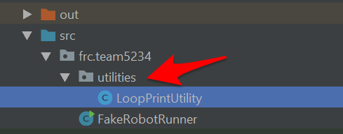
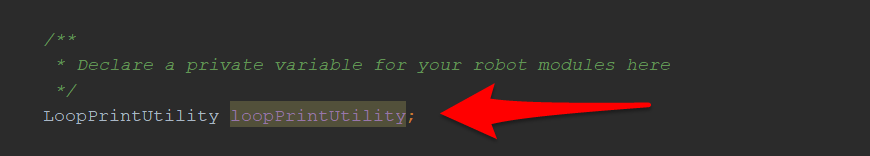
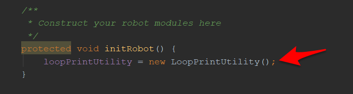
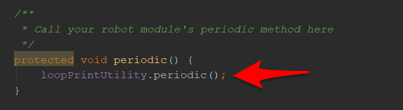

# Fake Robot

FakeRobotRunner is a utility class designed for students to use while testing small functions built for a robot.

## Usage

To utilize the [FakeRobotRunner](src/frc/team5234/FakeRobotRunner.java) you need to do the following.

1. Add your utility class to the utilities package
2. Declare a variable that references your utility class
3. Construct the utility class in the `initRobot()` function
4. Call your utility's `periodic()` function from within the `FakeRobotRunner` `periodic()` function

### Step 1

### Step 2

### Step 3

### Step 4

## Data

Sometimes it is useful to visualize data before making decisions about how to program something. The following Google Sheets provide some insight on a way that you might do this.

